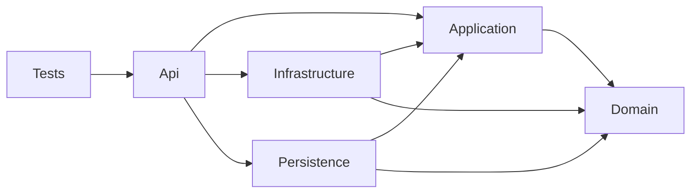

# Clean Architecture

*Last updated: 2026-08-18*

> The six layers a backend service splits into, and the direction its references run.
> Use case — every backend service; a throwaway spike deviates under § *Deviation*.

## Layers

| Layer | Project | Reaches |
|---|---|---|
| Domain | `{Brand}.Domain` | the model itself — nothing outbound |
| Application | `{Brand}.Application` | the use cases, and the interfaces the outer layers implement |
| Infrastructure | `{Brand}.Infrastructure` | implementations of Application interfaces |
| Persistence | `{Brand}.Persistence` | data access |
| Api | `{Brand}.Api` | the HTTP surface, and the host that wires every other layer |
| Testing | `{Brand}.Tests.{Type}` | every tier, in its own `tests/` solution folder → [testing](testing.md) |

- must give each layer its own class-library project, so the dependency rule is compiler-enforced
- must declare an interface in Application and its implementation in Infrastructure
- must not list the components a layer holds here — each domain states what it declares, per layer
- must leave the folders inside a layer to [domain structuring](domain-structuring.md)

---

## Dependency direction

An arrow reads *depends on*.

- must keep Domain free of every outbound reference
- must reference Domain from Application, Infrastructure and Persistence only
- must register DI in Api — the one layer that sees both Infrastructure and Persistence

---

## Host

- must keep `Program.cs` at three lines — `builder.Configure()` → `app.Configure()` → `app.Run()`
- must declare `Configure(builder)` and `Configure(app)` on the partial `HostConfiguration` class
- must put every DI registration in `Api/Configurations/HostConfiguration.Extensions.cs` as extension methods
- must bind configuration in Api alone → [host configuration](../../platform/startup/host-configuration.md)

---

## Deviation

- may inline the layers as folders in one project for a throwaway spike — ≲2 KLOC, no extraction, no second consumer
- must not default to layers-as-folders for a service that ships, grows, or feeds the SDK
- must skip the Application / Infrastructure / Persistence split in an SDK package — it is a library, not a service
- must give a CLI tool Application and Domain only, adding Persistence when it reads or writes files
